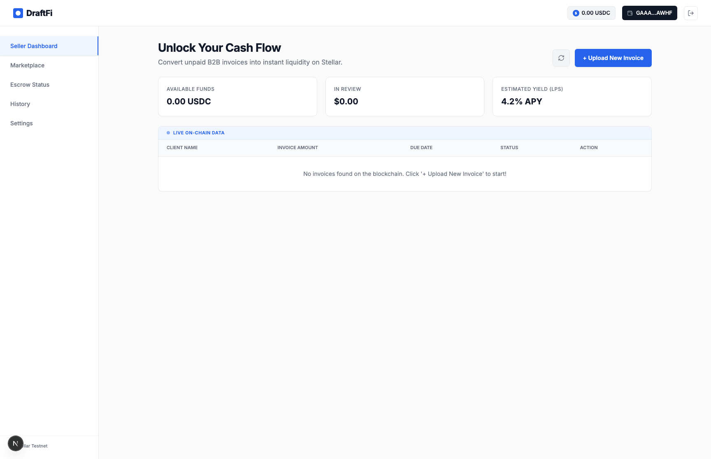
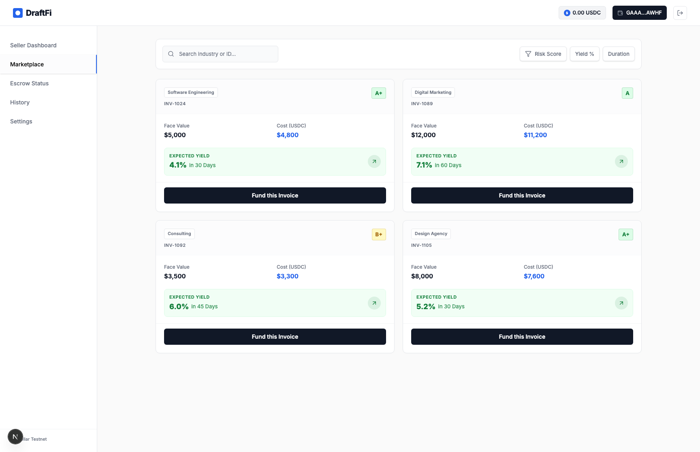
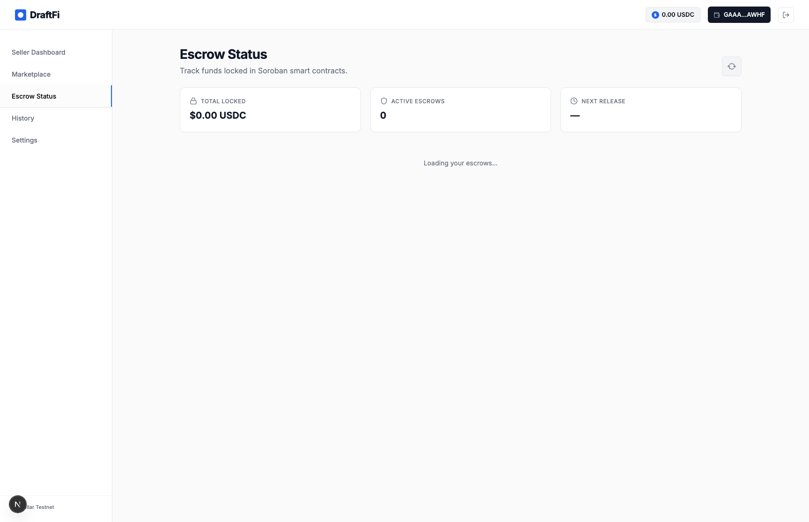
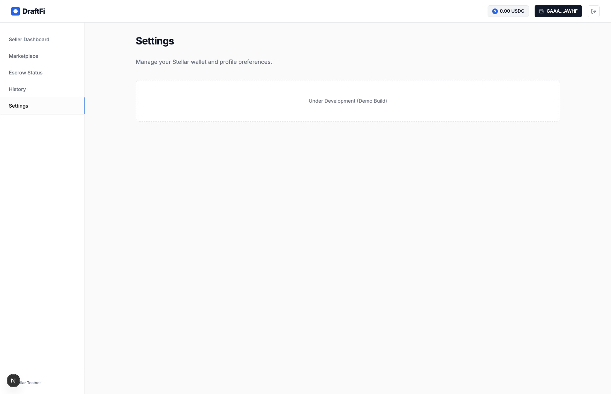

# DraftFi: The Invisible Invoice Liquidity Protocol

## 0. Testnet Deployment (All Contract IDs)

Network: Stellar Testnet  
Network Passphrase: Test SDF Network ; September 2015  
Soroban RPC: https://soroban-testnet.stellar.org  
Horizon: https://horizon-testnet.stellar.org

| Contract         | Testnet Contract ID                                      |
| ---------------- | -------------------------------------------------------- |
| Invoice Registry | CAVXMNHXEJDSLRZRV5FVSLCUQE2MSTAHVDNMM7R4JAGJEHGDGIBH7S65 |
| Marketplace      | CARGBDS37Q5ZWWIKFSEDA2AIRF5MDZWMGWFSGCKULR66X6BBLM44FDHD |
| Escrow           | CDKGNHOJTXQVRXA242YMLSRMCITAAZYG7VZ5E2C5PFADQUO7G76O7WCB |
| DraftFi Core     | CCBFEMK44JL6VMTYGQ2U4T6B5ASEOZWREYH4QNMPEFLF7DDEN7TWERT4 |
| USDC Token       | CDLZFC3SYJYDZT7K67VZ75HPJVIEUVNIXF47ZG2FB2RMQQVU2HHGCYSC |

These contract IDs are sourced from the frontend testnet environment configuration.

## 0.1 App Screenshots

All screenshots below were captured automatically from the local app and saved in the assets folder.

### Auth Screen

### Seller Dashboard

### Marketplace

### Escrow Status

### History

### Settings

## 1. Project Overview

DraftFi is a next-generation decentralized invoice factoring exchange. It bridges the gap between traditional B2B finance and the Stellar blockchain by allowing freelancers, remote engineers, and agencies to convert their outstanding invoices into instant USDC liquidity. By utilizing AI-powered OSINT (Open-Source Intelligence) for underwriting and Soroban smart contracts for trustless settlement, DraftFi eliminates the standard 30-90 day waiting period for payments.

## 2. The Problem: The "Cash Flow Death Valley"

The borderless economy is growing, yet cross-border B2B payments remain archaic. Remote professionals and small agencies often face "Net-30" or "Net-60" payment terms. They complete high-value work today but must wait months for corporate clients to settle the bill. Traditional factoring services are inaccessible to solo developers due to high entry barriers, manual bureaucracy, and lack of transparency.

## 3. The Solution: DraftFi

DraftFi provides a "zero-touch" liquidity engine:

- **Invisible Blockchain:** Users experience a clean SaaS interface without needing to understand blockchain complexities.
- **Instant Underwriting:** AI agents analyze invoice metadata and client credibility in seconds.
- **Decentralized Liquidity:** Investors fund verified invoices, earning a yield while providing immediate cash flow to the workforce.

## 4. Key Features & Technologies

### 🧠 AI-Driven OSINT Underwriting

Unlike traditional systems that require manual audits, DraftFi uses an AI brain (Next.js + LLM) to:

- Verify corporate domain legitimacy and email trails.
- Profile the client company via OSINT APIs (Apollo, Whois, LinkedIn).
- Assign an automated Risk Score (A+ to C).

### 🔐 Soroban Smart Contracts

- **Dynamic Collateral:** Holds 20% of the invoice value as "skin-in-the-game" to mitigate fraud.
- **Automated Settlement:** Automatically distributes funds to investors and returns collateral to the user once the fiat payment is confirmed.

### 🌊 Stellar Network Integration

- **USDC:** Used as the primary liquidity asset for stability and low-cost transfers.
- **Asset Minting:** Each invoice is minted as a unique representational asset on-chain.
- **Passkey Signer:** Allows users to sign transactions using biometric security (FaceID/TouchID).

## 5. The Workflow

1.  **Submission:** The user uploads a PDF invoice to the Next.js dashboard.
2.  **Verification:** The AI analyzes the invoice and sends a "Magic Link" to the client's finance department for cryptographic acknowledgement.
3.  **Minting:** Upon approval, the invoice is listed on the DraftFi marketplace as a Stellar asset.
4.  **Funding:** Liquidity Providers buy the invoice at a discount.
5.  **Liquidation:** The user receives 80% of the value instantly in USDC.
6.  **Settlement:** When the client pays the fiat invoice, the smart contract settles the debt and releases the remaining 20% to the user.

## 6. Business Model

- **Origination Fee:** 0.5% - 1.0% per funded invoice.
- **Interest Spread:** Margin between the discounted purchase price and the face value.
- **Settlement Fee:** Processing fee for routing fiat-to-USDC via Stellar Anchors.
